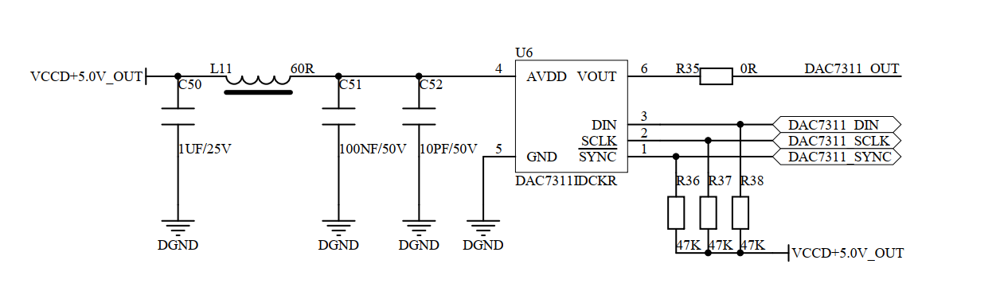
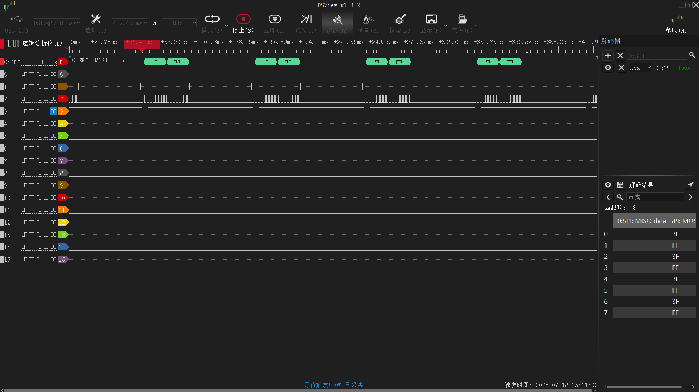

# verify-dac7311idckr-demo

基于 STM32F103 + RT-Thread 的 DAC3511 SPI DAC 验证工程，用于泵控/模拟输出场景的硬件功能验证。

## 概述

本项目通过软件 SPI（GPIO Bit-Bang）驱动 DAC3511 12-bit 单通道 DAC，支持电压设定、原始值写入、百分比控制和省电模式，配合 RT-Thread Shell 进行交互式调试验证。

## 硬件信息

| 项目 | 说明 |
|------|------|
| MCU | STM32F103（72MHz，Cortex-M3） |
| DAC | DAC3511（12-bit，单通道，SPI） |
| VREF | 5.0V（VDD） |
| 输出范围 | 0 ~ 5.0V |

### 引脚连接

| STM32 引脚 | DAC3511 引脚 | 功能 |
|------------|-------------|------|
| PB7 | SYNC | 片选（低电平有效） |
| PB8 | SCLK | SPI 时钟 |
| PB9 | DIN | SPI 数据输入 |

---

## DAC3511 寄存器详解

### 16-bit SPI 帧格式

DAC3511 采用 16-bit SPI 帧，MSB First（bit15 先发）。帧结构如下：

```
Bit:  15  14 │ 13  12  11  10   9   8   7   6   5   4   3   2 │  1   0
      ─────────┼────────────────────────────────────────────────┼──────────
       M1  M0 │ D11 D10  D9  D8  D7  D6  D5  D4  D3  D2  D1  D0 │  R   R
      ─────────┼────────────────────────────────────────────────┼──────────
       模式控制 │              12-bit 有效数据                    │  保留位
```

各字段说明：

| 字段 | Bit 位 | 说明 |
|------|--------|------|
| **M1:M0** | D15:D14 | 工作模式控制（见下表） |
| **D11:D0** | D13:D2 | 12-bit DAC 数据（MSB First） |
| **R:R** | D1:D0 | 保留位，固定为 0 |

### 工作模式（M1:M0）

| M1 | M0 | 模式 | 说明 |
|----|----|------|------|
| 0 | 0 | Normal | 正常工作，DAC 输出有效 |
| 0 | 1 | Power-Down 1kΩ | 下电，输出通过 1kΩ 电阻接地 |
| 1 | 0 | Power-Down 100kΩ | 下电，输出通过 100kΩ 电阻接地 |
| 1 | 1 | Power-Down Hi-Z | 下电，输出高阻态 |

> **注意**：Power-Down 模式下 DAC 输出被拉到地，不是分压，仅用于降低功耗。

### 保留位（D1:D0）

D1 和 D0 为芯片保留位，**必须始终写入 0**。

---

## 输出电压计算

### 公式

```
VOUT = VREF × D / 4096
```

其中：
- **VREF** = 参考电压 = VDD = 5.0V
- **D** = 12-bit 数据值（0 ~ 4095）
- **4096** = 2^12（12-bit 分辨率）

### 计算示例

| 目标电压 | 计算过程 | 12-bit 值 (D) | 16-bit 帧 (hex) | 16-bit 帧 (二进制) |
|----------|----------|--------------|-----------------|-------------------|
| 0.000V | 0.0 × 4096 / 5.0 = 0 | 0 (0x000) | `0x0000` | `00 000000000000 00` |
| 1.250V | 1.25 × 4096 / 5.0 = 1024 | 1024 (0x400) | `0x1000` | `00 010000000000 00` |
| 2.500V | 2.5 × 4096 / 5.0 = 2048 | 2048 (0x800) | `0x2000` | `00 100000000000 00` |
| 3.750V | 3.75 × 4096 / 5.0 = 3072 | 3072 (0xC00) | `0x3000` | `00 110000000000 00` |
| 4.999V | 5.0 × 4095 / 5.0 = 4095 | 4095 (0xFFF) | `0x3FFC` | `00 111111111111 00` |

### 反向计算（从帧值求电压）

```
VOUT = VREF × (帧值 >> 2) / 4096
```

例如帧值 `0x2000`：
```
D = 0x2000 >> 2 = 0x800 = 2048
VOUT = 5.0 × 2048 / 4096 = 2.500V
```

---

## 帧构造方法

### 代码实现

```c
/* 12-bit 数据值 (0~4095) */
uint16_t value = 2048;  /* 对应 2.5V */

/* 构造 16-bit 帧 */
uint16_t frame = (mode << 14) | (value << 2);
/*  mode = 0x00 (Normal)
 *  frame = (0x00 << 14) | (2048 << 2)
 *        = 0x0000 | 0x2000
 *        = 0x2000
 */
```

### 位操作分解

```
mode << 14:    将模式放到 D15:D14
value << 2:    将 12-bit 数据放到 D13:D2（左移 2 位）
D1:D0:         自动为 0（保留位）
```

### 从帧中提取数据

```c
uint16_t frame = 0x2000;

/* 提取模式 */
uint8_t mode = (frame >> 14) & 0x03;    /* = 0x00 (Normal) */

/* 提取 12-bit 数据 */
uint16_t value = (frame >> 2) & 0x0FFF; /* = 0x800 = 2048 */

/* 计算电压 */
float voltage = 5.0f * value / 4096.0f; /* = 2.500V */
```

---

## SPI 时序要求

DAC3511 使用 SPI Mode 0（CPOL=0, CPHA=0）：

```
          ┌──────────────────────────────────────────────────┐
SYNC  ────┘                                                  └────
          │  D15  D14  D13  D12  D11  D10 ... D2   D1   D0  │
          │                                                   │
SCLK  ────┘ ┌─┐ ┌─┐ ┌─┐ ┌─┐ ┌─┐ ┌─┐     ┌─┐ ┌─┐ ┌─┐       └──
       ─────┘ └─┘ └─┘ └─┘ └─┘ └─┘ └─┘ ... └─┘ └─┘ └─┘ ────────
          │                                                   │
DIN   ────┤═══╤═══╤═══╤═══╤═══╤═══╤═══...═══╤═══╤═══╤═══├────
          │   M1  M0  D11 D10 D9  D8  ... D2  R   R       │
          └──────────────────────────────────────────────────┘

       │←── SYNC 建立时间 ──→│←── 16 个 SCLK 周期 ──→│← 保持 →│
```

### 关键时序参数

| 参数 | 最小值 | 说明 |
|------|--------|------|
| SYNC 建立时间 | 33ns | SYNC 下降到第一个 SCLK 上升沿 |
| SCLK 高电平 | 33ns | SCLK 高电平持续时间 |
| SCLK 低电平 | 33ns | SCLK 低电平持续时间 |
| DIN 建立时间 | 5ns | 数据在 SCLK 上升沿前必须稳定 |
| DIN 保持时间 | 5ns | 数据在 SCLK 上升沿后保持 |
| SYNC 保持时间 | 0ns | 最后一个 SCLK 到 SYNC 拉高 |

> **本项目使用 GPIO Bit-Bang 实现**，默认 SCLK 半周期约 140ns（NOP 延时），远大于 33ns 要求。可通过 `dac7311_set_delay(us)` 调整时钟速度。

---

## 驱动 API

```c
/* 初始化 DAC3511 GPIO（开漏输出 + 外部上拉），输出 0V */
void dac7311_init(void);

/* 设定输出电压（0.0 ~ 5.0V），自动钳位 */
void dac7311_set_voltage(float voltage);

/* 设定 12-bit 原始值（0 ~ 4095） */
void dac7311_set_raw(uint16_t value);

/* 设定百分比（0 ~ 100%），映射到 0 ~ VREF */
void dac7311_set_percent(uint8_t percent);

/* 设置省电模式（Normal / 1k / 100k / HiZ） */
void dac7311_power_down(uint8_t mode);

/* 获取当前输出电压 */
float dac7311_get_voltage(void);

/* 写入原始 16-bit 帧（含模式+数据+保留位） */
void dac7311_write_raw_frame(uint16_t frame);

/* 设置 SPI 时钟延时（0=快速~140ns，>0=微秒级半周期） */
void dac7311_set_delay(uint32_t delay_us);

/* 获取当前 SPI 时钟延时 */
uint32_t dac7311_get_delay(void);
```

---

## Shell 调试命令

串口波特率 115200，连接后可使用以下命令：

### 基本控制

```bash
# 设定电压
dac volt 2.5          # 输出 2.5V

# 设定原始 12-bit 值
dac raw 2048          # 输出 2.5V（2048/4096 × 5.0）

# 设定百分比
dac pct 50            # 输出 50% = 2.5V

# 省电模式
dac pd 0              # 正常模式
dac pd 1              # 1kΩ 下拉省电
dac pd 2              # 100kΩ 下拉省电
dac pd 3              # 高阻态

# 查看状态
dac info
```

### SPI 协议测试（示波器抓波形）

```bash
# 默认：每 10ms 发送 0x2000（2.5V），快速时钟
dac test

# 自定义：每 100ms 发送 0x3FFC（5.0V），SCLK 半周期 500μs
dac test 100 0x3FFC 500

# 停止测试
dac test stop

# 查看测试状态
dac test info
```

**示波器接线**：
- CH1 → PB7（SYNC）— 触发源，下降沿触发
- CH2 → PB8（SCLK）
- CH3 → PB9（DIN）

### 波形发生器（DAC 输出周期波形）

```bash
# 正弦波：10Hz，幅度 2.5V，偏移 2.5V（输出 0~5V）
dac wave sin 10 2.5 2.5

# 方波：100Hz
dac wave square 100 1.5 2.5

# 三角波、锯齿波
dac wave tri 50 2 2.5
dac wave saw 20 2.5 2.5

# 停止
dac wave stop
```

---

## 常见电压速查表

| 电压 | 12-bit 值 | `dac raw` 命令 | 16-bit 帧 | `dac test` 帧值 |
|------|----------|---------------|-----------|----------------|
| 0.000V | 0 | `dac raw 0` | `0x0000` | `0x0000` |
| 0.500V | 410 | `dac raw 410` | `0x0668` | `0x0668` |
| 1.000V | 819 | `dac raw 819` | `0x0CCC` | `0x0CCC` |
| 1.250V | 1024 | `dac raw 1024` | `0x1000` | `0x1000` |
| 2.000V | 1638 | `dac raw 1638` | `0x1998` | `0x1998` |
| 2.500V | 2048 | `dac raw 2048` | `0x2000` | `0x2000` |
| 3.000V | 2458 | `dac raw 2458` | `0x2668` | `0x2668` |
| 3.750V | 3072 | `dac raw 3072` | `0x3000` | `0x3000` |
| 4.000V | 3277 | `dac raw 3277` | `0x3334` | `0x3334` |
| 5.000V | 4095 | `dac raw 4095` | `0x3FFC` | `0x3FFC` |

---

## 工程结构

```
verify-dac7311idckr-demo/
├── applications/
│   ├── main.c                    # 应用入口 + RT-Thread Shell 命令
│   └── macSYS/
│       ├── Inc/
│       │   ├── bsp_sys.h         # BSP 系统配置
│       │   └── dac7311.h         # DAC 驱动头文件
│       └── Src/
│           ├── bsp_sys.c         # BSP 系统实现
│           └── dac7311.c         # DAC 驱动实现（GPIO Bit-Bang SPI）
├── docs/
│   └── 我的项目概要.md
├── images/
│   └── dac7311_schemtic.png      # 原理图
├── rt-thread/                    # RT-Thread 内核 + 组件
├── LICENSE                       # Apache 2.0
└── README.md
```

## 原理图



## SPI 协议波形（逻辑分析仪实测）



上图为逻辑分析仪抓取的实际 SPI 通信波形，三通道分别为：
- **CH1（PB7/SYNC）**：帧同步信号，下降沿开始一帧传输
- **CH2（PB8/SCLK）**：SPI 时钟，16 个脉冲对应 16-bit 数据
- **CH3（PB9/DIN）**：串行数据，MSB First

## 构建环境

- **IDE**：RT-Thread Studio / Keil MDK
- **RTOS**：RT-Thread（标准版）
- **芯片**：STM32F103 系列

## License

[Apache License 2.0](LICENSE)
